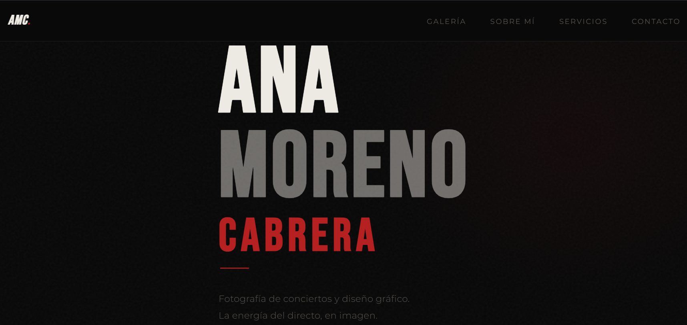
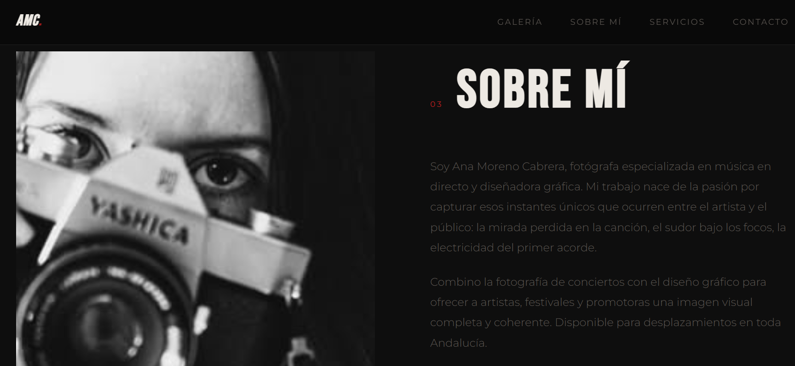
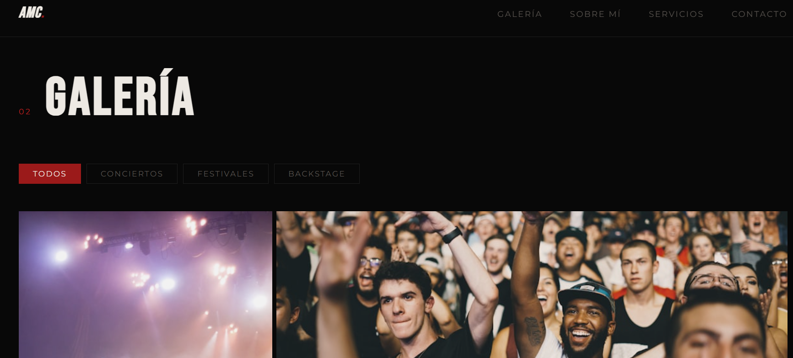

# Ana Moreno — Portfolio

Portfolio profesional de Ana Moreno, fotógrafa de conciertos y diseñadora gráfica.

## 📸 Preview

<div style="display: grid; grid-template-columns: repeat(3, 1fr); gap: 15px;">





</div>

## Stack

- **React 19** + **Vite 7**
- **CSS puro** con variables (sin frameworks)
- **GitHub Actions** para despliegue automático en GitHub Pages

## Desarrollo local

```bash
npm install
npm run dev
```

## Personalización rápida

| Qué cambiar | Dónde |
|---|---|
| Nombre, bio y stats | `src/components/About.jsx` |
| Foto de perfil de Ana | `src/components/About.jsx` → importa tu imagen |
| Fotos de la galería | `src/components/Gallery.jsx` → array `photos` |
| Precios y servicios | `src/components/Services.jsx` → array `services` |
| Email y redes sociales | `src/components/Contact.jsx` y `Footer.jsx` |
| URL base (nombre del repo) | `vite.config.js` → `base` |

## Añadir fotos

1. Copia tus fotos en `src/assets/`
2. En `Gallery.jsx` importa cada foto: `import foto1 from '../assets/foto1.jpg'`
3. Úsala en el array `photos`: `src: foto1`

## Despliegue en GitHub Pages

Ver instrucciones completas en la guía adjunta.

## Formulario de contacto

El formulario usa un `alert` de placeholder. Para hacerlo funcional:

1. Crea una cuenta gratis en [Formspree](https://formspree.io)
2. Crea un nuevo formulario → copia el endpoint
3. En `Contact.jsx` cambia el `onSubmit` para hacer un `fetch` POST a ese endpoint

```js
const res = await fetch('https://formspree.io/f/TUCODIGO', {
  method: 'POST',
  headers: { 'Content-Type': 'application/json' },
  body: JSON.stringify({ name, email, message }),
})
```
